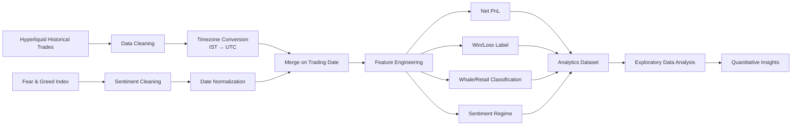
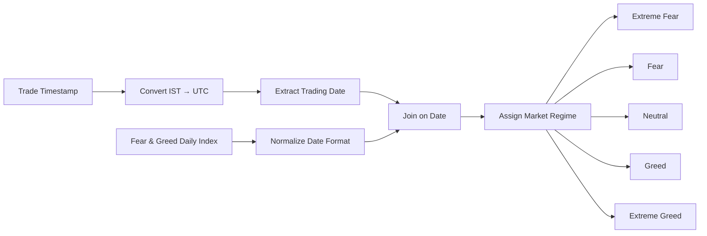

# Hyperliquid Trade Performance & Market Sentiment Analytics Pipeline

A production-style quantitative data engineering and analytics project that investigates how Bitcoin market sentiment influences trader performance on Hyperliquid.

The project builds an end-to-end ETL pipeline that cleans raw trading data, aligns it with the Crypto Fear & Greed Index, engineers analytical features, and generates insights into trading performance across different market sentiment regimes.

---

# Project Overview

The pipeline performs the following stages:



---

# Dataset

## Hyperliquid Historical Trades

Contains historical trading executions including:

- Account
- Coin
- Position Size
- Entry Price
- Exit Price
- Closed PnL
- Trading Fee
- Execution Timestamp

---

## Bitcoin Fear & Greed Index

Daily sentiment indicator ranging from:

- Extreme Fear
- Fear
- Neutral
- Greed
- Extreme Greed

The dataset is merged with trading activity to evaluate trader performance under different market conditions.

---

# Engineering Pipeline

The ETL pipeline consists of four major stages.

## 1. Data Cleaning

- Remove duplicate records
- Handle missing values
- Convert numeric columns
- Standardize column names

---

## 2. Time Alignment

Trade timestamps are originally stored in IST.

They are converted into UTC before joining with the daily Fear & Greed dataset.

```
IST Timestamp
        │
        ▼
UTC Timestamp
        │
        ▼
Trading Date
```

---

## 3. Feature Engineering

Several analytical features are generated.

### Net Profit

```
Net PnL = Closed PnL − Fee
```

---
## 4. Sentiment Analysis Flow



---

### Trade Outcome

```
Net PnL > 0
        ↓
       Win

Net PnL ≤ 0
        ↓
      Loss
```

---

### Trader Category

Traders are segmented using the 90th percentile of absolute trade size.

```
Top 10%
      ↓
   Whale

Remaining
      ↓
   Retail
```

---

### Sentiment Regime

Every trade receives one of five market labels:

- Extreme Fear
- Fear
- Neutral
- Greed
- Extreme Greed

---

# Repository Structure

```
crypto_sentiment_analysis/

│
├── data
│   ├── raw
│   │     historical_data.csv
│   │     fear_greed_index.csv
│   │
│   └── processed
│         analytics_base.csv
│
├── notebooks
│      01_eda_notebook.ipynb
│
├── src
│      pipeline.py
│      analysis.py
│
├── requirements.txt
│
└── README.md
```

---

# Installation

Clone the repository.

```bash
git clone https://github.com/yourusername/crypto_sentiment_analysis.git

cd crypto_sentiment_analysis
```

Create a virtual environment.

```bash
python -m venv venv
```

Activate it.

Linux / Mac

```bash
source venv/bin/activate
```

Windows

```powershell
venv\Scripts\activate
```

Install dependencies.

```bash
pip install -r requirements.txt
```

---

# Running the Pipeline

Place the datasets inside

```
data/raw/
```

Run

```bash
python src/pipeline.py
```

The processed dataset will be generated inside

```
data/processed/
```

---

# Exploratory Analysis

The notebook performs:

- Distribution of Net PnL
- Win Rate Analysis
- Sentiment-wise Performance
- Whale vs Retail Comparison
- Trading Volume Analysis
- Profitability by Market Regime

---

# Quantitative Risk Metrics

The notebook also computes professional trading metrics including:

- Win Rate
- Average Net PnL
- Profit Factor
- Trade Expectancy
- Maximum Drawdown (Proxy)
- Trade Distribution

These metrics help evaluate trading quality rather than relying only on profitability.

---

# Key Findings

## 1. Neutral Markets Are Least Profitable

- Lowest win rate
- Lowest average profitability
- Highest trading friction

**Observation**

Range-bound markets generate frequent false breakouts, reducing overall trading performance.

---

## 2. Extreme Greed Shows Highest Performance

- Highest average Net PnL
- Highest win percentage
- Strong trend continuation

**Observation**

Momentum-based strategies outperform counter-trend approaches during strong bullish sentiment.

---

## 3. Whale vs Retail

Retail traders achieve a slightly higher win rate.

Whales, however, generate substantially higher profit per successful trade due to larger position sizing.

---

# Technologies Used

- Python
- Pandas
- NumPy
- Matplotlib
- Seaborn
- Jupyter Notebook

---

# Future Improvements

Potential machine learning extensions include:

- Trade Profitability Prediction
- Win/Loss Classification
- Position Sizing Optimization
- Risk Scoring Model
- Time Series Forecasting
- XGBoost / Random Forest Models
- LSTM-based Market Prediction

---

# Results

The project demonstrates how combining market sentiment with historical execution data provides meaningful insight into trading behavior.

Rather than relying solely on price action, incorporating macro sentiment enables deeper quantitative analysis of trader performance across different market environments.

---

# Author

**Sahil Singh**

Engineering Student | Data Analytics | Machine Learning | Quantitative Finance